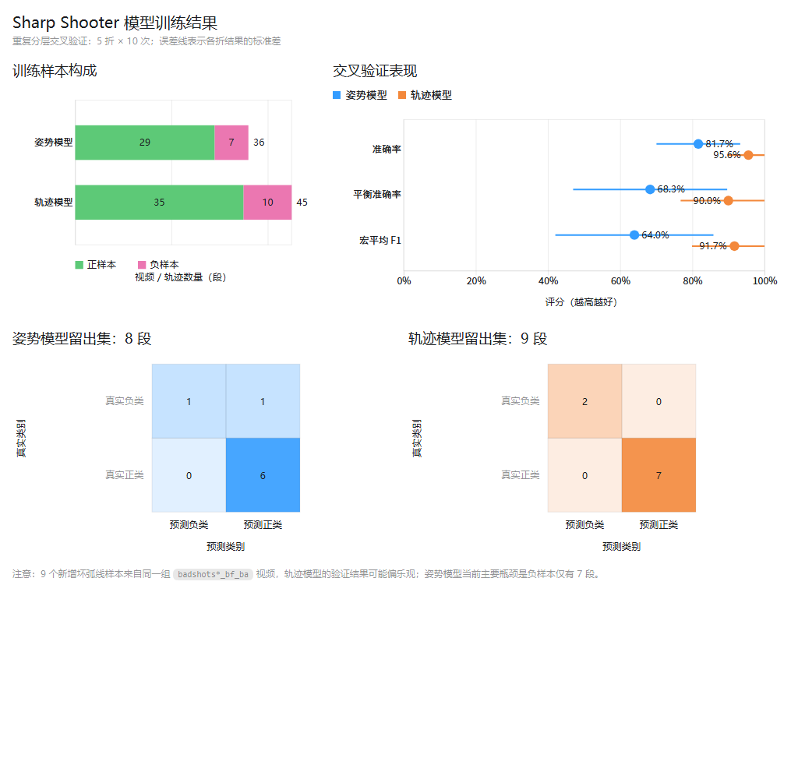

# Training results — 2026-08-13

This historical evaluation used five-fold, ten-repeat stratified cross-validation:

- Pose model: 36 recordings (29 positive and 7 negative), accuracy `81.7%`,
  balanced accuracy `68.3%`, and macro F1 `64.0%`.
- Trajectory model: 45 trajectories (35 positive and 10 negative), accuracy
  `95.6%`, balanced accuracy `90.0%`, and macro F1 `91.7%`.
- The pose classifier changed from Random Forest to a class-balanced Extra Trees
  model selected on the small internal dataset.
- Nine reviewed bad-arc candidate trajectories with successful ball detections
  were added to the trajectory dataset.

These were promising internal results, not proof of statistical significance or
generalization to new users. The 2026-08-15 protocol supersedes these summary
numbers with a fixed aggregation method, per-class recall, confusion matrices,
and recording-level 95% confidence intervals. This page remains unchanged as a
historical record.
